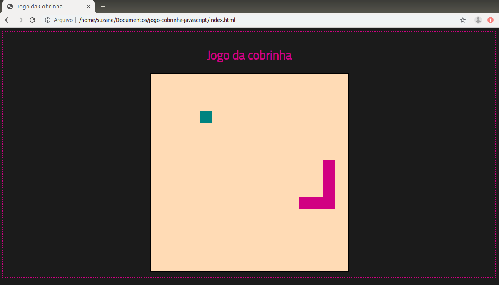

# Recriando o jogo da cobrinha com JavaScript :snake:

 Este projeto apresenta o clássico jogo da cobrinha utilizando HTML, CSS e JavaScript.
 Este é um desafio de projeto da Digital Innovation One no bootcamp HTML Web Developer.

## :gear: Tecnologias

- HTML5
- CSS3
- JavaScript

## :art: Layout

